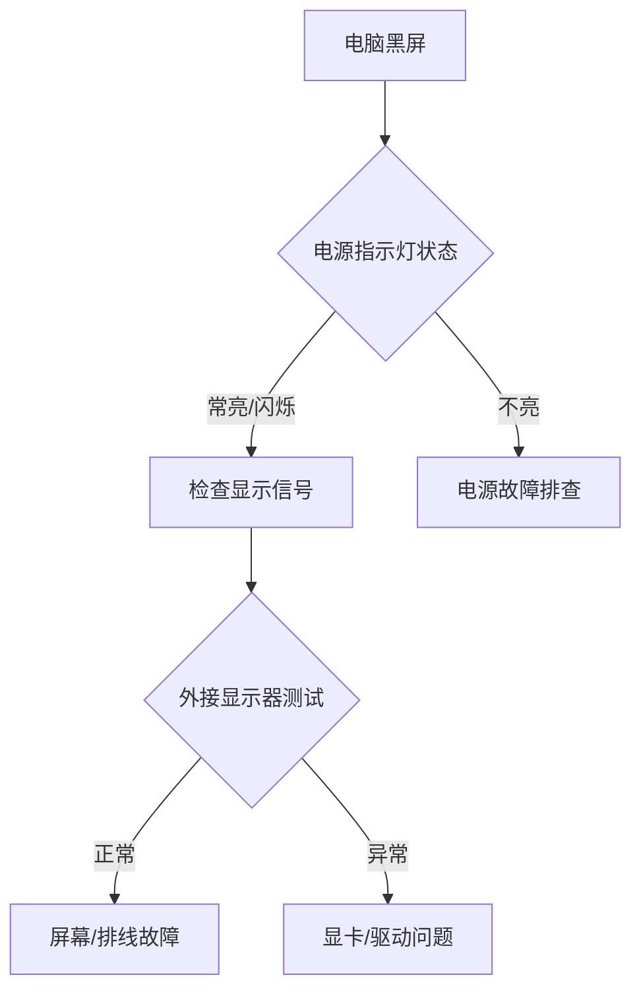

**电脑黑屏处理**

---

### **一、紧急状态诊断流程**



---

### **二、硬件级故障处理方案**

#### 1. **电源系统检测**

- **台式机**：
  
  - 短接电源24Pin接口的**绿线**与**黑线**（使用回形针），风扇转动则电源正常
  - 检查主板电容是否鼓包（重点观察CPU供电区域）
- **笔记本**：
  
  - 移除电池直连电源适配器
  - 使用万用表检测充电口电压（正常值：19-20V ±5%）

#### 2. **核心硬件排查**

- **内存故障**：
  
  ```markdown
  1. 拆机后橡皮擦清洁金手指（45度角单向擦拭）
  2. 单条内存交替测试各插槽
  3. 蜂鸣器报警音解读：  
     - 1长3短：显卡故障  
     - 连续短响：内存异常
  ```
- **显卡检测**：
  
  - 核显用户：移除独立显卡，连接主板视频接口
  - 使用PCIe检测卡：查看错误代码（如代码"d6"表示显存故障）

---

### **三、显示系统深度修复**

#### 1. **屏幕背光测试**

- 强光照射屏幕表面，观察是否有微弱图像
- 笔记本快捷键尝试调节亮度（Fn+亮度键）

#### 2. **信号传输检修**

- **线材测试**：
  
  | 接口类型   | 检测要点                  | 替换方案        |
|------------|---------------------------|-----------------|
| HDMI       | 接口针脚是否弯曲          | 镀金接口线材    |
| DP         | 版本匹配（1.4/2.0）       | 带磁环抗干扰线  |
| VGA        | 行场同步信号电压（0.7-1V）| 15针全通测试    |
  
  
- **接口焊接**：
  
  ```tip
  使用热风枪（350℃）补焊显卡输出接口，重点加固：
  ▶ HDMI接口的18/19针（TMDS时钟通道）
  ▶ DP接口的20/21针（主链路通道）
  ```

---

### **四、系统级恢复操作**

#### 1. **安全模式入口**

- **Win10/11**：
  
  - 强制重启3次进入恢复环境 → 疑难解答 → 启动设置 → 启用低分辨率视频模式
- **命令行修复**：
  
  ```cmd
  bootrec /rebuildbcd  # 重建BCD存储
  sfc /scannow /offbootdir=C:\ /offwindir=C:\Windows  # 脱机系统扫描
  ```

#### 2. **显卡驱动回滚**

- **NVIDIA**：
  ```powershell
  pnputil /enum-drivers  # 列出所有驱动
  pnputil /delete-driver oem0.inf /uninstall  # 卸载问题驱动
  ```
  
  - 推荐版本：472.12（稳定性认证版）

---

### **五、进阶维修工具包**

| 工具类型       | 推荐设备              | 应用场景                  |
|----------------|-----------------------|--------------------------|
| 电路检测       | 福禄克17B+万用表      | 测量主板关键供电点        |
| 焊接维修       | 快克2008热风枪        | BGA芯片补焊               |
| 信号发生器     | Hantek示波器          | 分析EDID通信波形          |

---

### **六、数据抢救预案**

```warning
⚠️ 若黑屏但硬盘仍在运转：  
1. 立即停止通电操作  
2. 通过USB转接盒导出数据  
3. 使用R-Studio进行扇区级恢复
```

---

**操作风险提示**：

- 焊接操作需佩戴防静电手环
- 笔记本屏线拆卸需使用专用撬棒（厚度＜0.6mm）

遇到特定品牌机型（如MacBook背光门）可提供型号获取专属维修方案！

