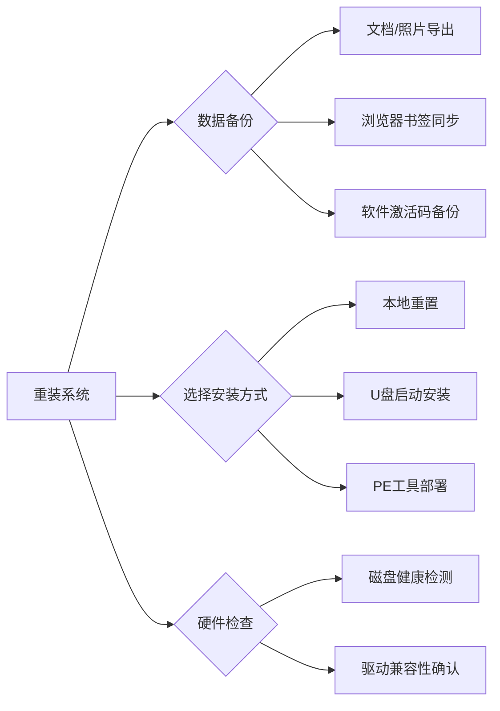

### **一、重装系统全流程图**

---

### **二、Windows系统重装**

#### 1. 官方纯净版安装（推荐方案）

**▸ 步骤详解：**

1. **制作启动盘**
   
   - 工具：微软媒体创建工具（[官网下载](https://www.microsoft.com/software-download)）
   - 容量：≥8GB USB3.0闪存盘
   - 验证：`certutil -hashfile ISO镜像 SHA256` 校验完整性
2. **BIOS关键设置**
   
   | 品牌    | 启动键 | 必改项                  |
|---------|--------|-------------------------|
| 联想    | F12    | 关闭Secure Boot         |
| 戴尔    | F2     | UEFI模式优先            |
| 华硕    | ESC    | 关闭Fast Startup        |
   
   
3. **分区技巧**
   
   - 固态硬盘：删除所有分区→新建→自动对齐4K扇区
   - 机械硬盘：保留系统分区≥120GB（Win11要求64GB）
   - 陷阱规避：避免在已加密硬盘直接安装（需先解密）

#### 2. 系统优化四件套

powershell

# 禁用自动更新（专业版可用）

reg add "HKLM\SOFTWARE\Policies\Microsoft\Windows\WindowsUpdate\AU" /v NoAutoUpdate /t REG_DWORD /d 1 /f

# 关闭遥测数据

services.msc → 禁用「Connected User Experiences and Telemetry」

# 必备运行库

[推荐] DirectX修复工具 + Microsoft Visual C++ Redist合集

# 驱动安装优先级

主板芯片组 → 显卡 → 声卡 → 网卡 → 外设

### **三、应急故障处理库**

#### 1. 安装过程蓝屏代码

| 代码         | 诱因分析               | 解决方案                 |
|--------------|------------------------|--------------------------|
| INACCESSIBLE_BOOT_DEVICE | 磁盘控制器驱动缺失 | 注入Intel RST/VMD驱动  |
| UNSUPPORTED_PROCESSOR    | 老CPU不支持新系统   | 修改ISO添加绕过补丁     |
| 0x80070002              | 安装介质损坏       | 重新下载镜像并验证哈希  |

#### 2. 激活失败解决方案

- **数字权利激活**：
  登录微软账户→设置→更新与安全→激活→疑难解答
- **KMS工具选择**：
  [推荐] HWIDGen、HKA、MAS（数字证书永久激活）
  [注意] 企业环境需使用正版Volume License

---

### **五、必备工具包下载**

| 工具类型     | 推荐工具               | 核心功能                     |
|--------------|------------------------|------------------------------|
| 启动盘制作   | Ventoy（跨平台支持）   | 多系统镜像U盘启动            |
| 分区管理     | DiskGenius专业版       | 4K对齐检测/分区表修复        |
| 驱动备份     | Driver Talent         | 离线驱动打包导出             |
| 系统精简     | NTLite                | 移除预装应用/定制安装包      |

